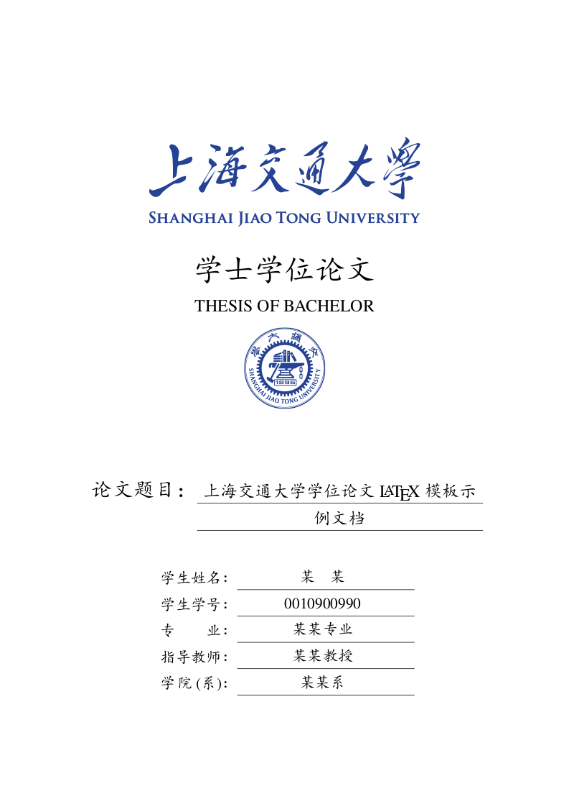
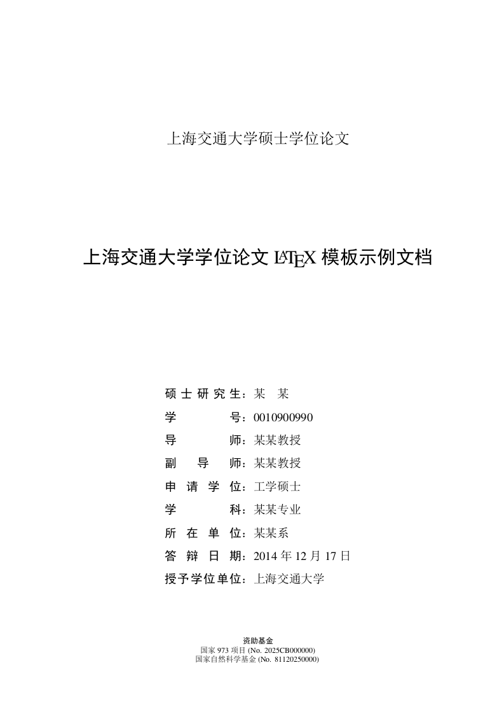

# 上海交通大学学位论文模板

[](https://travis-ci.org/sjtug/SJTUThesis)
[](https://ci.appveyor.com/project/SJTUG/sjtuthesis/branch/master)
[](https://github.com/sjtug/SJTUThesis/releases)
[](https://github.com/sjtug/SJTUThesis/releases)
[](https://gitter.im/sjtug/SJTUThesis?utm_source=badge&utm_medium=badge&utm_campaign=pr-badge&utm_content=badge)

这是为撰写上海交通大学学士、硕士或博士论文而准备的 XeLaTeX 模板，非官方出品。生成的学位论文文件参见 [README.pdf][README]，详细使用说明参见 [SJTUThesis Wiki](https://github.com/sjtug/SJTUThesis/wiki)。

## 封面展示

<div align="center">
    <a href="http://sjtug.org/SJTUThesis/bachelor.pdf"></a>
    <a href="http://sjtug.org/SJTUThesis/master.pdf"></a>
    <a href="http://sjtug.org/SJTUThesis/doctor.pdf"></a>
</div>


## 如何使用

SJTUThesis 共有三种编译方式支持:

* [本地编译](#本地编译)
* [在 ShareLaTeX 网站上进行在线编译](#sharelatex-在线编译)
* [在 Docker 容器中编译](#使用-docker-编译)

第一种编译方式需要在本地安装 TeX 发行版，好处在于环境问题少，坏处在于安装过程比较漫长且繁琐。第二种编译方式是完全在线的，不需要在本地安装任何环境，缺点在于需要完全依赖 ShareLaTeX 网站，其在国内的稳定性存疑。第三种方式需要在本地安装 Docker，相比第一种，不会污染本地的环境。但要求用户对 Docker 有一定了解。

### 本地编译

因为本地编译涉及到 TeX 发行版的安装, 因此具体可参见 [本地安装使用指南](https://github.com/sjtug/SJTUThesis/wiki/%E6%9C%AC%E5%9C%B0%E5%AE%89%E8%A3%85%E4%BD%BF%E7%94%A8%E8%AF%B4%E6%98%8E)

### ShareLaTeX 在线编译

[](https://www.sharelatex.com/templates/5a54637e8cd4f9d91b6b6416)
[](https://www.sharelatex.com/templates/588163ec93a02abc513710fd)
[](https://www.sharelatex.com/templates/566ea0fb08f4ac510fbc6b9e)

我们有多个版本的模板在 ShareLaTeX 上可用，但是推荐使用最新版本，以避免可能遇到的一些问题。此外如果在 ShareLaTeX 上遇到问题建议尝试本地编译。

### 使用 Docker 编译

[](https://quay.io/repository/sjtug/sjtuthesis)

在模板目录下执行以下命令即可:

```shell
docker pull quay.io/sjtug/sjtuthesis
./scripts/start-build.sh
```

## Makefile 使用

### 编译生成学位论文 PDF 文件

通过以下指令，可以编译生成 thesis.pdf：

```bash
make
```

### 持续编译

编写学位论文往往是一个修改 -> 查看论文 PDF 显示效果 -> 继续修改的过程。因此我们实现了持续编译的支持。在文件被修改后，会自动进行新一轮的编译，产生新的 PDF 文件，在写论文时无需写完重新运行 `make`：

```bash
make pvc
```

### 清除所有生成文件

使用以下指令可以清除之前所有的构建文件：

```bash
make clean
```

### 查看字数统计

通过以下指令，可以查看目前的字数：

```bash
make wordcount
```

目前会统计两种字数：纯中文字数与总字数（英文单词 + 中文字）。其中纯中文字数只统计中文字，如英语单词，数字等都不予计入。总字数统计英文单词，以及中文字的总和，其中一个单词视为一个字。

## 反馈问题

如果在使用上有任何问题，建议先阅读[常见问题与建议](https://github.com/sjtug/SJTUThesis/wiki/%E5%B8%B8%E8%A7%81%E9%97%AE%E9%A2%98%E4%B8%8E%E5%BB%BA%E8%AE%AE)。如果这些不能解决你的问题，建议以如下的顺序反馈使用过程中的问题：

* [在 GitHub 项目主页开 issue](https://github.com/sjtug/SJTUThesis/issues) (推荐)
* [在水源 BBS TeX_LaTeX 版发帖](https://bbs.sjtu.edu.cn/bbsdoc?board=TeX_LaTeX)

如果你觉得项目的使用体验不好，或者想感谢我们的维护者们等等任何与使用无关的想法，都可以通过我们的[在线聊天频道](https://gitter.im/sjtug/SJTUThesis)告诉我们。

## 如何贡献

SJTUThesis 是一个由诸多感兴趣的同学一起维护的开源项目，我们非常欢迎新的贡献者! 这里有很多贡献的方式:

* 帮助我们解答同学们的[问题](https://github.com/sjtug/SJTUThesis/issues?utf8=%E2%9C%93&q=is%3Aissue+is%3Aopen+label%3Atype%2Fquestion+)，这些问题你也可能遇到过并且知道如何解决
* 与我们一起维护项目的 [Wiki 文档](https://github.com/sjtug/SJTUThesis/wiki)，Wiki 是可以直接编辑的
* 向我们贡献代码，我们有一些对新的贡献者比较友好的问题，你可以从[这些问题](https://github.com/sjtug/SJTUThesis/issues?q=is%3Aissue+is%3Aopen+label%3Agood-first-issue)开始熟悉贡献代码的流程
* 向周围同学安利 SJTUThesis，让更多的同学使用我们维护的模板
* 在我们的[在线聊天频道上](https://gitter.im/sjtug/SJTUThesis)告诉我们你的使用体验，以及吐槽。如果你也想成为项目的长期维护者，也可以通过在线频道告诉我们 :-)

## 后续工作计划

* 分离学位论文的使用文档和示例文档，准备提交到 CTAN [#47](https://github.com/sjtug/SJTUThesis/issues/47)

## 致谢

* 感谢 [CTeX](http://www.ctex.org/HomePage) 提供了 LaTeX 的中文支持
* 感谢那位最先制作出博士学位论文 LaTeX 模板的交大物理系同学
* 感谢 William Wang 同学对模板移植做出的巨大贡献
* 感谢 [@weijianwen](https://github.com/weijianwen) 学长一直以来的开发和维护工作
* 感谢 [@sjtug](https://github.com/sjtug) 以及 [@dyweb](https://github.com/dyweb) 对 0.9.5 之后版本的开发和维护工作
* 感谢所有为模板贡献过代码的[同学们](https://github.com/sjtug/SJTUThesis/graphs/contributors)，以及所有测试和使用模板的各位同学

## 软件许可证

上海交通大学校徽图片(`sjtulogo.pdf` 等)的版权归上海交通大学所有。其他部分使用 [Apache License 2.0](LICENSE) 授权。

[README]: http://sjtug.org/SJTUThesis/README.pdf
[0.9.5]: https://github.com/sjtug/SJTUThesis/releases/tag/0.9.5
